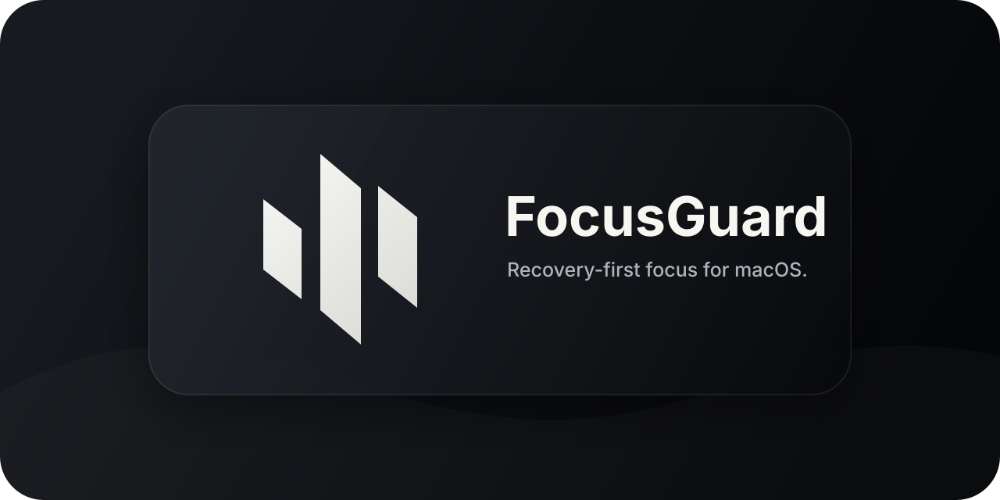

# FocusGuard

FocusGuard is a native macOS menu-bar app for staying attached to the work you said you were going to do.

Start a promise, keep the timer visible, and let FocusGuard watch for drift using local context first. When it detects that you have wandered, it interrupts with a recovery action instead of a dashboard, score, report, streak, or productivity feed.

## What It Does

- Keeps the active promise and countdown visible in the macOS menu bar.
- Samples foreground app, idle state, window title, and browser metadata.
- Applies deterministic local rules before asking an AI classifier.
- Shows a compact recovery prompt when the current context appears off-task.
- Runs as a local-first utility with no account, sync, analytics timeline, or product server.

## Status

FocusGuard is currently an MVP developer preview. It can be packaged as an unsigned `.app` zip for GitHub Releases, but it is not signed, notarized, or published through the App Store.

The v1 classifier boundary supports Codex CLI. If Codex is unavailable, logged out, sandboxed, slow, or returns invalid JSON, FocusGuard degrades safely to an unknown/no-interrupt result.

## Install

Homebrew from a cloned repository:

```sh
brew tap sergiopuj/focus-guard "$PWD"
brew install --cask sergiopuj/focus-guard/focusguard
```

Homebrew without cloning manually:

```sh
brew tap sergiopuj/focus-guard https://github.com/SergioPujol/focus-guard.git
brew install --cask sergiopuj/focus-guard/focusguard
```

The custom tap is this same repository. Homebrew refreshes a GitHub-backed tap during `brew update`, and later FocusGuard releases can be installed with `brew upgrade --cask focusguard`. Homebrew 6 requires casks to belong to a tap, so it no longer accepts `brew install --cask ./Casks/focusguard.rb` directly.

Direct download:

1. Download `FocusGuard-macOS.zip` from the [latest release](https://github.com/SergioPujol/focus-guard/releases/latest/download/FocusGuard-macOS.zip).
2. Open the zip and move `FocusGuard.app` to Applications.
3. Open FocusGuard from Applications.
4. If macOS blocks the app because it is unsigned, Control-click `FocusGuard.app`, choose `Open`, then confirm you want to open it.
5. Click the menu-bar icon and finish the setup checklist.

Both preview paths avoid requiring users to build the app. A signed and notarized release requires Apple Developer Program enrollment. See [docs/release.md](docs/release.md) for the release workflow.

For local development, build and launch from the repository root:

```sh
swift build
.build/debug/FocusGuard
```

FocusGuard appears as an accessory app in the macOS menu bar.

## Permissions

FocusGuard can run in degraded mode, but useful context requires macOS privacy permissions:

- Accessibility: reads active window titles and UI metadata.
- Automation/browser scripting: reads browser URL/title metadata when macOS and the browser allow it.
- Screen Recording: reserved for explicit screenshot capture and work-surface inspection.

The app shows a setup checklist in the popover. After granting permissions in System Settings, click `Test Again`.

## Codex Setup

FocusGuard v1 expects Codex CLI at:

```sh
/opt/homebrew/bin/codex
```

Check the local CLI:

```sh
codex --version
codex exec --ephemeral "Return exactly ok"
```

Safe fallback response when classification cannot run:

```json
{"status":"unknown","recovery_action":"none","interrupt":false}
```

## Privacy Model

FocusGuard is local-first by design:

- no cloud account
- no project-owned server
- no analytics timeline
- no reports, scores, or streaks
- local rules stored locally
- screenshots not persisted by default
- screenshots not continuously uploaded

The current MVP uses metadata first. Screenshot-to-Codex classification is treated as explicit, visible, and opt-in because screen contents can contain private data.

## Capture Model

Current behavior:

- metadata-first local observation
- in-memory screenshot buffer implementation
- visible capture state in the menu UI

Chosen v1 default:

- event-triggered screenshots after suspected drift or ambiguous metadata

Deferred until profiling:

- continuous local observation
- low-frequency screenshots
- persisted debug screenshots

## Local Development

Build the app:

```sh
swift build
```

Run automated core checks:

```sh
swift run FocusGuardChecks
```

Launch the app:

```sh
.build/debug/FocusGuard
```

Create an unsigned release zip for manual testing:

```sh
scripts/package-macos-app.sh
```

Optional: create a signed and notarized release zip when Apple Developer credentials are available:

```sh
SIGNING_IDENTITY="Developer ID Application: Your Name (TEAMID)" \
NOTARY_PROFILE="focusguard-notary" \
scripts/package-macos-app.sh
```

This Command Line Tools environment did not provide Swift Testing or XCTest modules, so automated checks are packaged as a small executable instead of `swift test`.

## Troubleshooting

`swift build` cannot write SwiftPM caches:

- Run from a normal terminal or allow SwiftPM access to user-level caches.

`xcodebuild` fails:

- This repo uses SwiftPM and does not require an Xcode project for the MVP.

Codex preflight fails:

- Confirm `/opt/homebrew/bin/codex` exists.
- Run `codex --version`.
- Run a small `codex exec --ephemeral` prompt from a normal terminal.

No window title or browser URL:

- Grant Accessibility.
- Some browsers require Automation permission before AppleScript URL/title reads work.

Screen capture is blocked:

- Grant Screen Recording in System Settings.
- Restart the app after granting permission.

## Known Limitations

- The app is currently distributed as an unsigned developer preview, so macOS Gatekeeper may require a manual open confirmation.
- Recovery actions show fallback instructions instead of performing browser/app automation.
- ScreenCaptureKit capture is not wired yet; `ScreenshotBuffer` is implemented and tested as the safe storage boundary.
- Codex calls are slow and token-heavy for high-frequency polling.
- Real screenshot classification must remain explicit and opt-in.
- There is no provider platform, browser extension, cloud sync, reports, scores, or App Store packaging in v1.
